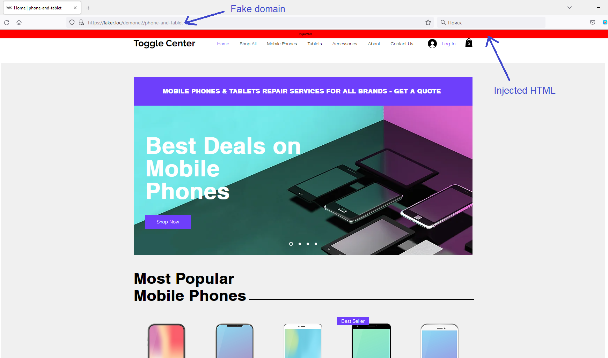

# What is this project about?

This tool lets you to deploy a server which will act like proxy between browser and some real domain. All requests from client will be passed to the real domain and all URLs in responses will be substituted on fake domain.  

Technically speaking, it is phishing tool, but you can use it for a lot of good reasons:

1. Remove unwanted content from sites
2. Modify site design as you want

I am currently passive working on it, ant it is not production-ready! If you need some assistance, contact me in Telegram - [@Asen_17](https://t.me/AseN_17).  

**I hope to find some developing partners for this project - let me know if you would be interested working together!**

# How to use it?

Consider this project as experimental!  
It is currently on the stage of PoC, but still you can make it work with simple configuration:  

1. Configure `app.py` in `Config` section (read comments there)
    1. Set original domain and path you want to mimick
    2. Write HTML/JS code in `inject.html` you want to inject in original site`s code
2. Setup your fake domain. By default local domain used - `faker.loc`, configure it in local DNS settings (file `hosts`).
3. Run `app.py` - `python3 app.py`
4. Go to browser and open https://faker.loc
    1. If you use `path`, use it also in fake domain! So, according to default settings of `app.py` it should be - https://faker.loc/demone2/phone-and-tablet

# TODO

- fix enormously large div-block heights (noon, amazon, google) [something not loading correctly]
- more clever domain substitution [look for encoded domain name in HTML/JS]
- always substitute URL but with original path
- speedup HTTP requests
- make real domain configurable, not hardcoded [best way to do it - through named cookies]
